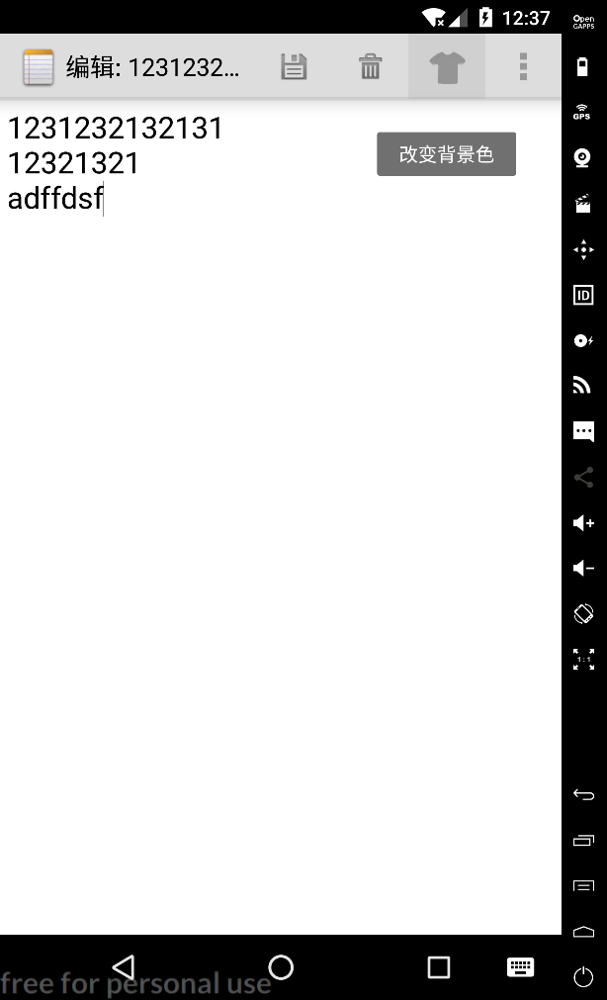
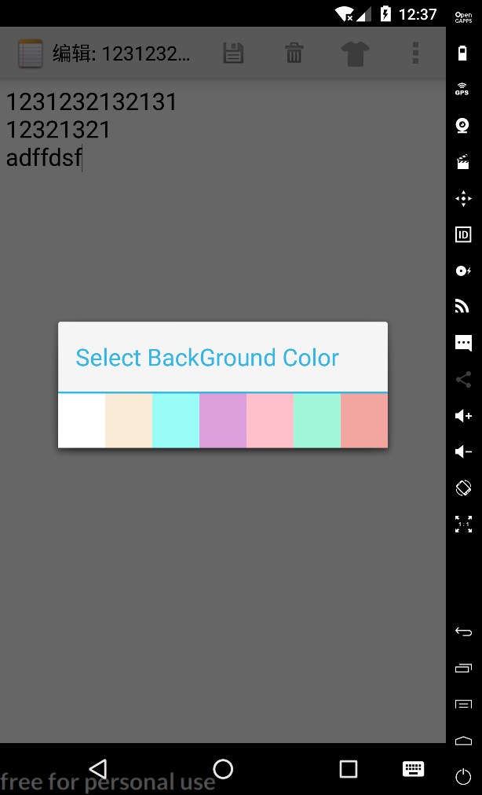

# NotePad(期中实验)

#### 1.NotePad笔记本应用

##### 基本要求：每个人必须完成
*   NoteList中显示条目增加时间戳显示
*   添加笔记查询功能（根据标题查询）

##### 附加功能：根据自身实际情况进行扩充，以下是建议的扩展功能

*   UI美化
*   更改记事本的背景
*   使用SQLite数据库进行数据存储
*   ContentProvider: ContentProvider用于数据共享，如果你不提供数据共享机制，可以不使用

#### 2.源码说明

目录结构

.png)

#### 3. 应用截图

便签浏览页颜色改变

改变标题

.png)

菜单

.png)

删除

.png)

编辑标题

.png)

列表排序规则

.png)

新建

.png)

保存

.png)

便签搜索

.png)