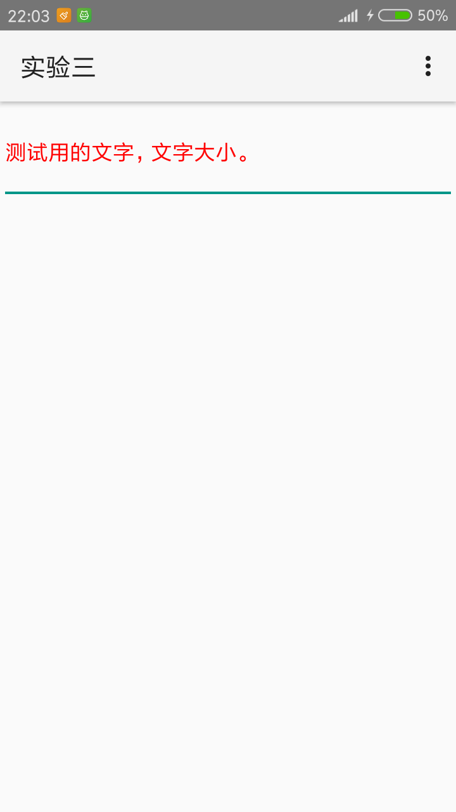

## AndroidUI组件
图片均为手机上的截图
### 1.Android ListView的用法

实验的四个布局都写在一个应用中，通过菜单切换到不同的布局

​	利用SimpleAdapter实现如下界面效果

### 2.创建自定义布局的AlertDialog

### 3.使用XML定义菜单

### 4.创建上下文操作模式(ActionMode)的上下文菜单

注：实现删除选项后颜色没有变回来，且单击时还是会选中
未选中时

长按选中时

